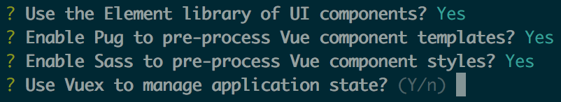

# vue-webpack-boilerplate

[Vue's official webpack boilerplate](https://github.com/vuejs-templates/webpack) +
[Vuex](https://vuex.vuejs.org) +
[Element](http://element.eleme.io/) +
[Pug](https://pugjs.org/) +
[Sass](http://sass-lang.com/) +
[Yarn](https://yarnpkg.com/)

This gives you 4 additional
[vue-cli](https://github.com/vuejs/vue-cli) options:


> A full-featured Webpack setup with hot-reload, lint-on-save, unit testing & css extraction.

> This template is Vue 2.0 compatible. For Vue 1.x use this command: `vue init JauntyTech/vue-webpack-boilerplate#1.0 my-project` (However, I'm not testing this fork with Vue 1.x, so use at your own risk.)

## Why use Vuex, Element, Pug, Sass, and/or Yarn?

These tools make Vue app development easier:

- [Vuex](https://vuex.vuejs.org) manages complex app state in an amazingly simple way
- [Element](http://element.eleme.io/) provides useful and good-looking UI components
- [Pug](https://pugjs.org/) makes template tags more readable
- [Sass](http://sass-lang.com/) makes style tags more readable
- [Yarn](https://yarnpkg.com/) prevents a lot of versioning problems

## Documentation

- [For Vue's official webpack template](http://vuejs-templates.github.io/webpack): common questions specific to this template are answered and each part is described in greater detail
- [For Vue 2.0](http://vuejs.org/guide/): general information about how to work with Vue, not specific to this template

## Usage

This is a project template for [vue-cli](https://github.com/vuejs/vue-cli). **It is recommended to use npm 3+ for a more efficient dependency tree.**

``` bash
$ npm install -g vue-cli
$ vue init JauntyTech/vue-webpack-boilerplate my-project
$ cd my-project
$ yarn
$ npm run dev
```

## What's Included

- `npm run dev`: first-in-class development experience.
  - Webpack + `vue-loader` for single file Vue components.
  - State preserving hot-reload
  - State preserving compilation error overlay
  - Lint-on-save with ESLint
  - Source maps

- `npm run build`: Production ready build.
  - JavaScript minified with [UglifyJS](https://github.com/mishoo/UglifyJS2).
  - HTML minified with [html-minifier](https://github.com/kangax/html-minifier).
  - CSS across all components extracted into a single file and minified with [cssnano](https://github.com/ben-eb/cssnano).
  - All static assets compiled with version hashes for efficient long-term caching, and a production `index.html` is auto-generated with proper URLs to these generated assets.

- `npm run unit`: Unit tests run in PhantomJS with [Karma](http://karma-runner.github.io/0.13/index.html) + [Mocha](http://mochajs.org/) + [karma-webpack](https://github.com/webpack/karma-webpack).
  - Supports ES2015 in test files.
  - Supports all webpack loaders.
  - Easy mock injection.

- `npm run e2e`: End-to-end tests with [Nightwatch](http://nightwatchjs.org/).
  - Run tests in multiple browsers in parallel.
  - Works with one command out of the box:
    - Selenium and chromedriver dependencies automatically handled.
    - Automatically spawns the Selenium server.

- `npm run theme`: Regenerate Element component styles in `theme/` from `element-variables.css`
  - See element-theme documentation: [here](http://element.eleme.io/#/en-US/component/custom-theme)

### Fork It And Make Your Own

You can fork this repo to create your own boilerplate, and use it with `vue-cli`:

``` bash
vue init username/repo my-project
```
